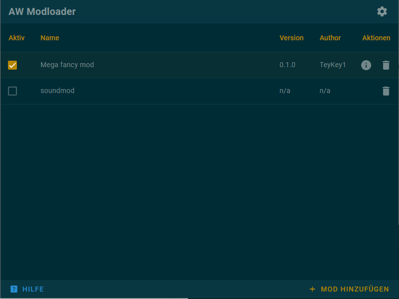

# AW Modloader

> The fancy overkill solution to automate a 30s process



This program allows to manage mods in AW. Currently only injection by using the localization method is supported. Please note that this is a project that was mainly created to get to know svelte and the tauri framework. Bugfixes etc. will happen but don't expect any super duper massive features in the future ;) (Unless you want to contribute of course)

- Load Mods into the program
- Manage mods by activating/deactivating them for the use ingame
- Version control of mods
- Collision detection of mods

**Now that's neat! How do I get this?**

As a user, simply download the program [here](https://github.com/TeyKey1/AW-Modloader/releases). (Only Windows 7-11 are supported. It has only been tested on windows 10 though)

## Mod Authors

In order to make your mod compatible with this modloader you have to follow the specified file structure in your archives.
Please note that currently only mods that work with the localization injection technique are supported.

**Required mod archive file structure**
(Allowed archive type is zip and 7z. if you use another I might be able to support it, please file an issue)

```
MyFancyMod.zip =>
  sounds/
    weapons/
    ...
  weapons/
  ...
```

```
ThisIsWrong.zip =>
  localization/
    <language>/
      ...
```

Generally the archive needs to represent the folder structure that is required inside the `localization/<language>/` folder.

**modinfo.json**

In order to attach more information to your mod that the modloader can use you can create a `modinfo.json` file. Using this file you can achieve proper version control of your mod in the modloader. The file needs to have the following JSON data:

```JSON
{
  "name": "My mod name",
  "author": "TeyKey1",
  "version": "0.1.0",
  "injection": "localization",
  "info": "This is an awesome mod info\nIt contains all the best tank colors\n\nmore info here: https://armoredlabs.net"
}
```

Parameters:

- **name** The name of your mod
- **author** You, probably
- **version** The current version of your mod. This needs to follow [Semver](https://semver.org/)
- **injection** Currently only "localization" is supported, so leave as is
- **info** Some info text about your mod. Can be multiline using escape characters

The `modinfo.json` file needs to reside in the base of the mod archive:

```
MyFancyMod.zip =>
  sounds/
    weapons/
    ...
  weapons/
  ...
  modinfo.json
```

## Other
The author of this application does not endorse the use of it for any use-case that violates the [agreement about modding AW](https://armoredlabs.net/index.php?/topic/166-modding-aw-a-statement-caveats/) and is not affiliated with Armored Warfare in any way.
